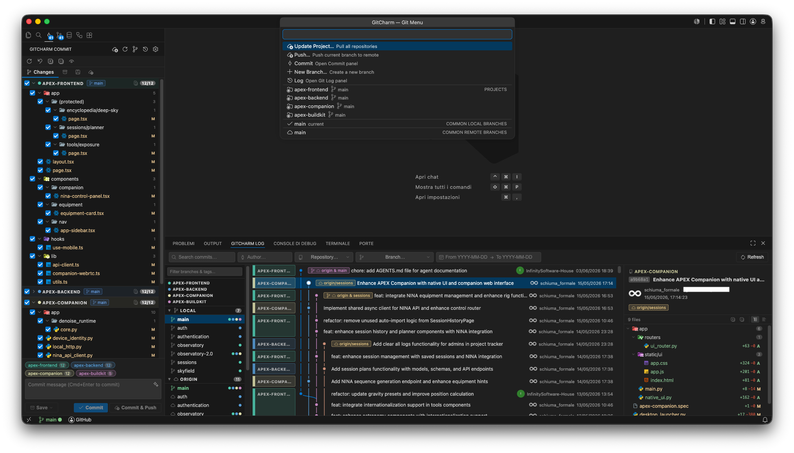
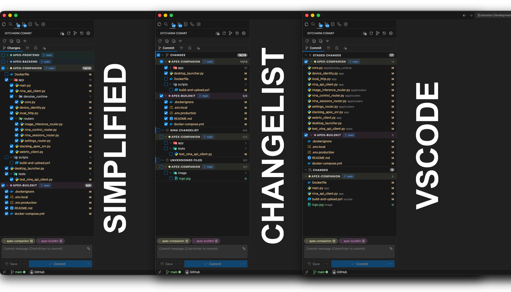
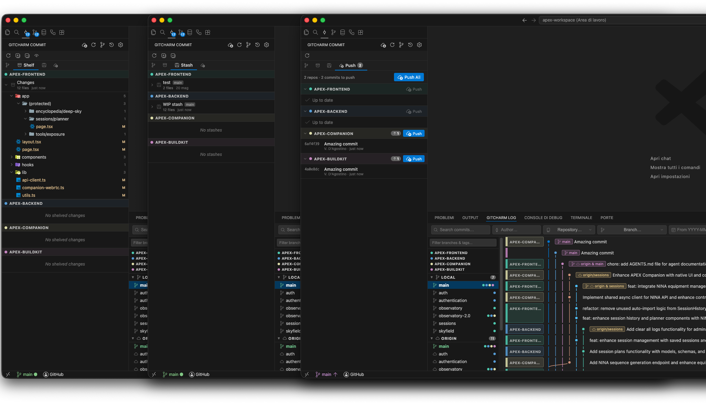
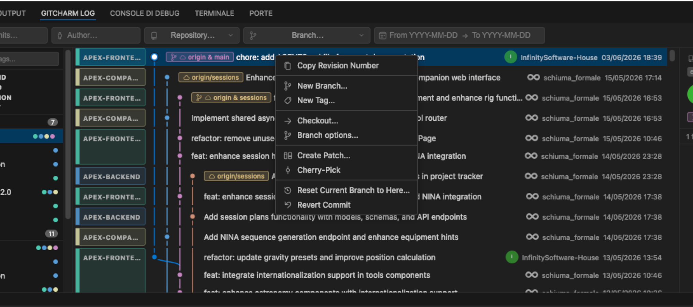
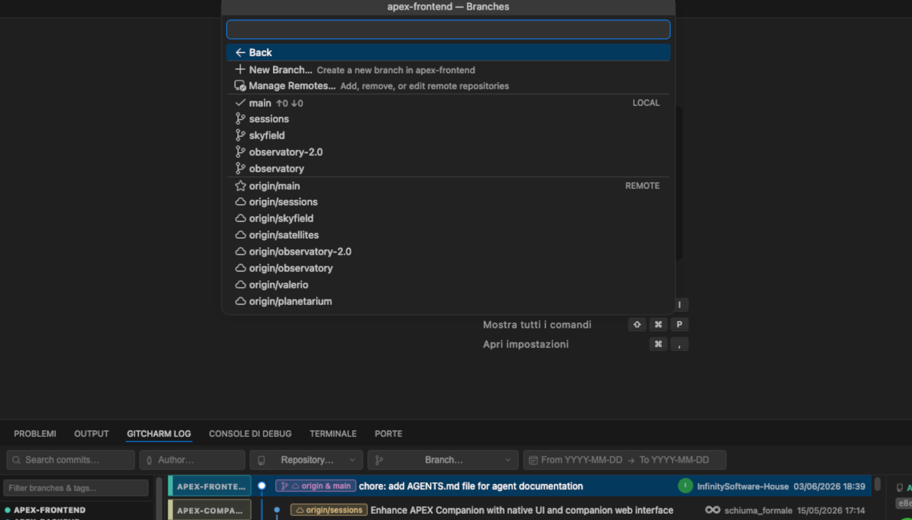
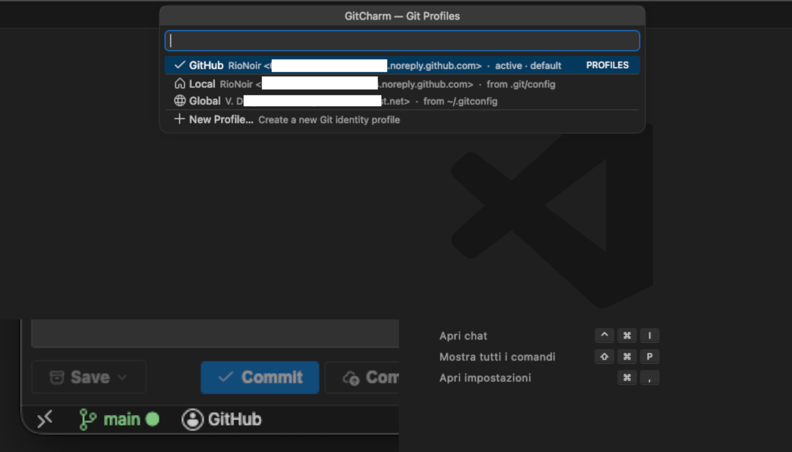
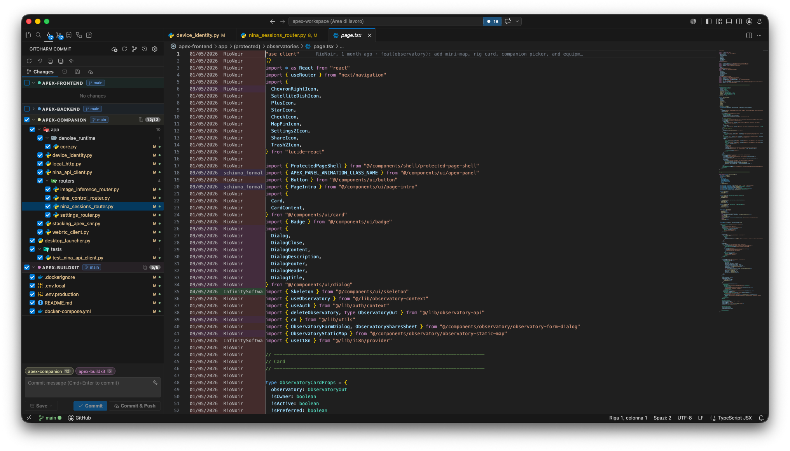

<p align="center">
  
</p>

<h1 align="center">GitCharm</h1>

<p align="center">
  JetBrains-like Git management for VS Code.
</p>

<p align="center">
  <a href="https://buymeacoffee.com/rionoir" target="_blank"></a>
  
  
  
  
  
</p>

GitCharm brings a JetBrains-like Git workflow to Visual Studio Code: a focused Commit panel, a Git Log panel with graph and branch operations, multi-repository awareness, shelving/stashing tools, push helpers, and a 3-way merge editor for conflict resolution.

It activates automatically when the opened workspace contains a Git repository.



## ✨ Features

### 📝 Commit Panel

- Staged/unstaged file list with tree and flat views (persisted across reloads).
- Per-file diff preview directly in the panel.
- Per-file actions: open, rollback, delete, add to `.gitignore`.
- Commit selected files only, or all staged changes.
- **Commit** and **Commit & Push** unified dropdown button; **Amend** and **Amend & Push** via the dropdown.
- AI commit-message generation with multi-provider support: Anthropic API, OpenAI API, Claude CLI, Codex CLI, Gemini CLI, Gemini API, Ollama, and LM Studio. API keys and models configurable per provider.
- Commit message pre-filled automatically with `Merge branch 'X' into 'Y'` when merge conflicts are detected.
- New and modified files are **not** automatically selected — only files that were already selected before the change are preserved.

#### View Modes

On first install, a QuickPick lets you choose your preferred view mode. You can change it at any time via `gitcharm.changesViewMode` in Settings.

| Mode | Description |
|:--|:--|
| **Simplified** | Staged and Unstaged sections grouped per repository (default) |
| **Changelists** | PhpStorm-style named changelists; files can be moved between lists |
| **VS Code** | Native-style Staged Changes / Changes sections with inline stage/unstage buttons |



#### Changelists

- Create, rename, and delete named changelists from the context menu.
- Drag files between changelists or use the context menu to reassign them.
- Default changelist and Unversioned Files list are always present.

#### Repository pills & commit targeting

- The commit message area shows a pill for each repository with staged/selected files.
- Click the **×** on a pill to quickly deselect that repository from the commit.
- In VS Code mode, a per-repository checkbox in the Staged Changes section controls which repositories are included.

### 🚀 Push Tab

- Lists unpushed commits for every repository, including branches without an upstream tracking branch.
- Commit count badge on the tab label, auto-updated after each commit, undo, or push.
- File count badge on the Changes tab label showing the total number of modified files.
- Branch info header with sync state: "Up to date", "N commits to pull from `<upstream>`", or "Local branch — not published" with matching badges (↑ ahead, ↓ behind, Unpublished).
- Per-commit stats showing files changed, additions, and deletions.
- Push button adapts to context: when the repo is both ahead and behind, it becomes a **Sync & Push** split-button; the dropdown exposes **Push** and **Force Push** options.
- Push button label adapts to context: "Push", "Publish Branch", "Publish Branches", or "Push & Publish" for mixed upstream/no-upstream selections.
- **Undo** the HEAD commit (with confirmation) directly from the push list.
- **Explain with AI** context menu action on commits: opens the detail panel with an auto-generated explanation of the changes.
- **Open Full Detail** context menu action on commits.
- Click any row to jump to that commit in the Git Log panel.
- **Publish** button for branches that have never been pushed.
- Silent refresh: existing commits stay visible while reloading (no flicker).

### 🗄️ Shelve & Stash

- **Shelve** with patch-based shelves: create, apply (full or partial), delete, rename, and inspect per-file diffs.
- Binary-file handling and conflict detection on unshelve.
- **Native stash** support: list, apply, pop, drop, rename, and file diff preview.
- Stashes are shown as native nodes directly in the Git Log commit list.
- Row selection is maintained when the context menu is open, matching the behavior of other tabs.



### 📜 Git Log Panel

- Commit graph with branch visualization.
- Branch sidebar: local branches, remote branches, tags; single-repo workspaces hide the repository list; sidebar is collapsible.
- Filters by text, author, branch, date, and repository; filter bar redesigned with compact controls.
- Commit detail with changed-file list and per-file diffs.
- Smart diff resolution for added, deleted, renamed, copied, merge, and root commits.
- **Show Combined Diff** context menu entry in the commit file list.
- Close button in the commit detail panel; clicking any commit re-opens it.
- Bold commit message for the HEAD commit in the list.
- Author name shown in commit rows when panel width > 500 px.
- Click a commit title to expand/collapse the message; if the commit has a body, it opens as a Markdown document in a VS Code tab.
- Author avatars in commit rows and commit detail: resolves GitHub noreply emails to GitHub avatars, other emails to Gravatar, with a colored-initials fallback. Initials correctly handle names with parenthesized suffixes (e.g. "Name Surname (Tag)").
- **Fetch and Refresh** button in the filters bar fetches all remotes before refreshing the log.
- **Explain with AI** and **Open Full Detail** context menu actions; AI actions hidden when AI is disabled.
- Branch operations from the sidebar: checkout, fetch, pull, push, merge, rebase, delete, rename, compare, and create new branch.
- **Tags section** in the sidebar: collapsible list with multi-repo dot indicators; tags with the same name across repos are merged into a single row; active tag highlighted when in detached HEAD state.
- Tag context menu: checkout, merge into current, push to remote, and delete (local, remote, or both).
- Commit context menu: **New Tag…** when the commit has no tags; **Manage Tags…** (QuickPick with merge/delete actions) when it does.
- **Checkout…** in the commit context menu: QuickPick lets you choose between checking out the branch or the revision (detached HEAD); works for remote-only branches too.
- **Branch options…** in the commit context menu: opens the Git Menu focused on that branch.
- Log Panel auto-refreshes in the background after a commit or push, with a loading skeleton during the fetch.
- Hides `origin/HEAD` from the remote branches list.

<br>


### 🌿 Branch Status Bar & Git Menu

- Shows the current branch name (truncated with ellipsis if long) with dirty, ahead, behind, and diverged states; shows the short commit hash when in detached HEAD state without a tag, or the tag name when checked out on a tag.
- **Branch menu** with quick access to: **Fetch All**, **Pull**, **Push All**, **Force Push All**, **Sync All** (pull then push, stops on conflicts), branch operations, and log.
- Same operations available per-repository in the sub-menu, without redundant repo name prefixes in labels.
- **Tags section** in the per-repository menu: checkout, merge, push to remote, and delete tags; delete dialog offers three options (local, remote, or both).
- **Per-repository sub-menu** with full remote management: add, rename, change URL, and remove remotes.
- Tracks the active editor to reflect the correct repository in multi-repo workspaces.

<br>


### 👤 Git Profiles

- Named identity profiles (display name, `git user.name`, `git user.email`) stored in workspace settings.
- Status bar item showing the active profile; click to switch, create, edit, delete, or set a default.
- Fallback chain: active GitCharm profile → Local (repo `.git/config`) → Global (`git config --global`).
- Set **Local** or **Global** as the default source per workspace without creating a named profile.
- Reserved names `Local` and `Global` are displayed as implicit entries with source tooltip.
- Active profile applied automatically to the local repo config before every commit.
- Each workspace/repository can use a different identity.

<br>


### 🔍 Git Annotations (Blame)

- Inline blame columns in the editor showing commit author, relative date, and summary.
- Ghost text with the same information rendered at the end of the current line.
- Hover actions link directly to the commit in the Git Log panel.
- Accessible via editor context menu and Command Palette; toggled with dedicated commands.
- Layout adapts around edits, tabs, CodeLens, and editor alignment.

<br>


### 🗂️ Multi-Repository Workspaces

- Per-project colors in the commit graph and commit panel.
- Grouped changes and a shared commit flow across repositories.
- Common branch actions applied across all repositories in one step.
- Activity bar badge showing the total number of changed files across all repositories.
- Nested repository scanning: automatically discovers Git repositories inside workspace subfolders up to a configurable depth, skipping ignored folders (e.g. `node_modules`). Files belonging to nested repos are filtered out from their parent repository's change list, matching VS Code's built-in behavior.
- Repository context menu in the Commit Panel header (all view modes and all tabs): quick access to branch operations, fetch, push, settings, **Reveal in Explorer**, **Open in New Window**, and **Open in File Manager** for each repository.
- Hide/show individual repositories from the Commit Panel and Log Panel via the context menu; hidden repos are persisted per workspace.

### 🌳 Worktrees

- Dedicated **Worktrees** tab in the Commit Panel listing all worktrees for each repository.
- Per-worktree actions: open in Explorer, open in new window, open in File Manager, add to workspace, lock/unlock, remove, and force-remove.
- Create new worktrees and prune stale ones directly from the tab.
- Primary worktree clearly labeled with a **primary** badge.

### ⚔️ Merge Editor

- 3-way conflict editor for files containing Git conflict markers.
- Side-by-side conflict panes with editable result.
- Conflict navigation, save, and automatic staging on completion.

## 📋 Requirements

- Visual Studio Code `1.85.0` or newer.
- Git installed and available in the workspace.
- Node.js `18` or newer and npm for development or packaging.

GitCharm uses VS Code's built-in Git extension when available and falls back to direct Git operations through `simple-git`.

## 📦 Installation

### From a VSIX

Build and package the extension:

```bash
npm install
npm run build
npm run package
```

Then install the generated `.vsix`:

```bash
code --install-extension gitcharm-0.3.5.vsix
```

### Development Host

Install dependencies, build once, then launch the extension host from VS Code:

```bash
npm install
npm run build
```

Open this repository in VS Code and run **Run Extension** from the Debug panel.

For iterative development:

```bash
npm run watch
```

## 🛠️ Usage

Open a workspace that contains one or more Git repositories. GitCharm adds:

- **GitCharm Commit** in the Activity Bar.
- **GitCharm Log** in the bottom Panel.
- A **branch item** and a **profile item** in the Status Bar.
- Commands in the Command Palette.

Use the Commit panel to select files, inspect diffs, write a commit message, commit, commit and push, shelve changes, manage stashes, or review unpushed commits.

Use the Log panel to browse history, filter commits, inspect changed files, open diffs, and run branch or commit operations.

Use the Status Bar branch menu for fast project-wide actions such as updating all repositories, pushing, creating branches, switching branches, managing remotes, or handling merge/rebase states.

## ⌨️ Commands

| Command | Description |
|:--|:--|
| `GitCharm: Focus Git Log` | Focuses the Git Log panel. |
| `GitCharm: Fetch All` | Fetches all remotes across all repositories. |
| `GitCharm: Pull` | Pulls all repositories (prompts for merge or rebase strategy). |
| `GitCharm: Push` | Pushes all repositories. |
| `GitCharm: Sync All` | Pulls then pushes all repositories; stops if any pull fails. |
| `GitCharm: Open Merge Editor` | Opens the merge editor for the active file when conflict markers are present. |
| `GitCharm: Branch Menu` | Opens the Status Bar branch menu. |
| `GitCharm: Settings` | Opens GitCharm settings. |
| `GitCharm: Manage Git Profiles` | Opens the Git profile manager. |
| `GitCharm: Switch Git Profile` | Switches the active Git profile for the current workspace. |
| `GitCharm: Open Git Annotations` | Shows inline blame annotations in the active editor. |
| `GitCharm: Close Git Annotations` | Hides inline blame annotations in the active editor. |
| `GitCharm: Select AI Provider` | Opens a QuickPick to choose and configure the AI provider and model. |
| `GitCharm: Generate Commit Message` | Generates an AI commit message from the current staged diff. |
| `GitCharm: Explain Commit` | Opens the commit detail panel with an AI-generated explanation of the selected commit. |

## ⌨️ Keybindings

| Keybinding | macOS | Command |
|:--|:--|:--|
| `Ctrl+Alt+L` | `Cmd+Alt+L` | `GitCharm: Focus Git Log` |
| `Ctrl+Alt+K` | `Cmd+Alt+K` | `GitCharm: Commit` |

## ⚙️ Settings

| Setting | Default | Description |
|:--|:--|:--|
| `gitcharm.graphMaxCommits` | `1000` | Maximum number of commits loaded into the Git Log graph. |
| `gitcharm.fetchOnStartup` | `true` | Fetches all remotes once when GitCharm activates. |
| `gitcharm.projectColors` | `{}` | Maps workspace folder/repository names to hex colors for multi-repo views. |
| `gitcharm.repositoryScanMaxDepth` | `1` | Maximum depth of workspace subfolders to scan for Git repositories. `0` only checks workspace folders. |
| `gitcharm.repositoryScanIgnoredFolders` | `["node_modules"]` | Folder names or workspace-relative paths skipped while scanning for nested Git repositories. |
| `gitcharm.autoRefreshInterval` | `0` | Auto-refresh interval in seconds. `0` disables interval refresh and uses file watchers only. |
| `gitcharm.changesViewMode` | `"simplified"` | How to display changed files: `simplified`, `changelists`, or `vscode`. Chosen via QuickPick on first install. |
| `gitcharm.gitAnnotations.enabled` | `true` | Enable inline Git blame annotations in the editor. |
| `gitcharm.gitGhostText.enabled` | `true` | Enable inline Git ghost text in the editor. |
| `gitcharm.gitProfiles` | `[]` | Named Git identity profiles (name, email) managed by GitCharm. |
| `gitcharm.activeGitProfileId` | `""` | ID of the currently active Git profile for this workspace. |
| `gitcharm.suppressDivergedWarning` | `false` | Suppress the "diverged" warning in the status bar when local and remote have diverged. |
| `gitcharm.ai.enabled` | `false` | Enable AI-powered features (commit message generation, commit explanation). |
| `gitcharm.ai.provider` | `"copilot"` | AI provider: `copilot`, `anthropic`, `openai`, `claude-cli`, `codex-cli`, `gemini-cli`, `gemini-api`, `ollama`, or `lmstudio`. |
| `gitcharm.ai.model` | `""` | Model identifier for the selected provider (leave empty to use the provider default). |
| `gitcharm.ai.language` | `""` | Language for AI-generated text (e.g. `en`, `it`). Defaults to English when empty. |
| `gitcharm.ai.anthropicApiKey` | `""` | API key for the Anthropic provider. |
| `gitcharm.ai.openaiApiKey` | `""` | API key for the OpenAI provider. |
| `gitcharm.ai.geminiApiKey` | `""` | API key for the Gemini API provider. |

Example:

```json
{
  "gitcharm.fetchOnStartup": true,
  "gitcharm.graphMaxCommits": 2000,
  "gitcharm.projectColors": {
    "api": "#ff6b6b",
    "web": "#4ec9b0"
  },
  "gitcharm.gitAnnotations.enabled": true
}
```

## 🏗️ Project Structure

```text
src/host/                 VS Code extension host code
src/host/git/             Git, diff, conflict, blame, workspace, and shelve services
src/host/panels/          Webview providers for Commit, Log, and Merge Editor
src/host/ui/              Status bar controllers, badge controller, and annotation controller
src/webview/commitPanel/  React Commit panel
src/webview/gitLog/       React Git Log panel
src/webview/mergeEditor/  React 3-way merge editor
src/webview/shared/       Shared webview components, hooks, and message types
media/                    Extension icons, codicons, and assets
out/                      Built extension and webview bundles
```

## 🔧 Development Scripts

| Script | Description |
|:--|:--|
| `npm run build` | Builds both extension host and webview bundles. |
| `npm run build:host` | Builds the extension host bundle with esbuild. |
| `npm run build:webview` | Builds all React webview bundles. |
| `npm run watch` | Watches host and webview sources in parallel. |
| `npm run lint` | Runs ESLint on TypeScript and TSX sources. |
| `npm run typecheck` | Type-checks the main TypeScript project. |
| `npm run typecheck:webview` | Type-checks the webview TypeScript project. |
| `npm run package` | Creates a VSIX package with `vsce`. |
| `npm run publish` | Publishes the extension with `vsce publish`. |

## 📌 Notes

- GitCharm is designed for Git workspaces and multi-root workspaces where each folder may be its own repository.
- Destructive operations (rollback, delete, branch delete, reset, stash drop, shelve drop, commit undo) ask for confirmation.
- AI commit-message generation requires an available VS Code language model such as GitHub Copilot.
- The merge editor works on files that contain Git conflict markers.
- Git Annotations require the file to be tracked in a Git repository with at least one commit.

## 🤝 Contributing

Contributions are welcome! To contribute:

1. **Fork** the repository
2. **Create** a branch for changes (`git checkout -b feature/your-feature`)
3. **Commit** the changes (`git commit -m 'Added your-feature'`)
4. **Push** to the branch (`git push origin feature/your-feature`)
5. **Open** a Pull Request

### 🐛 Bug Reporting

To report bugs, open an issue including:
- Extension version
- VSCode version
- Operating system
- What is the problem
- Full error log

### 💡 Feature Requests

For new features, open an issue describing:
- Desired functionality
- Specific use case
- Priority (low/medium/high)

## 📄 License

This project is distributed under the GNU General Public License v3.0.
