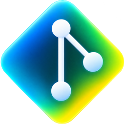
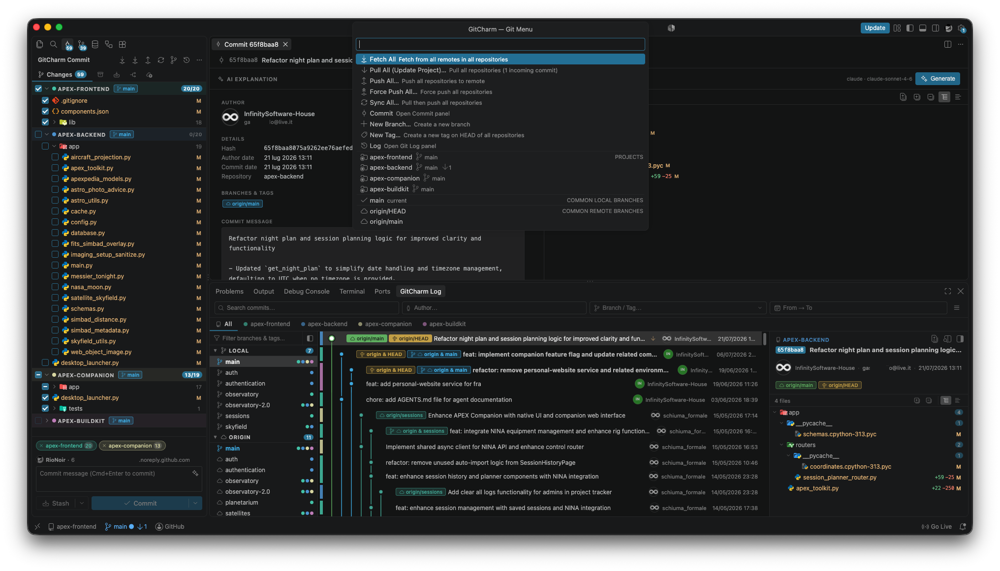
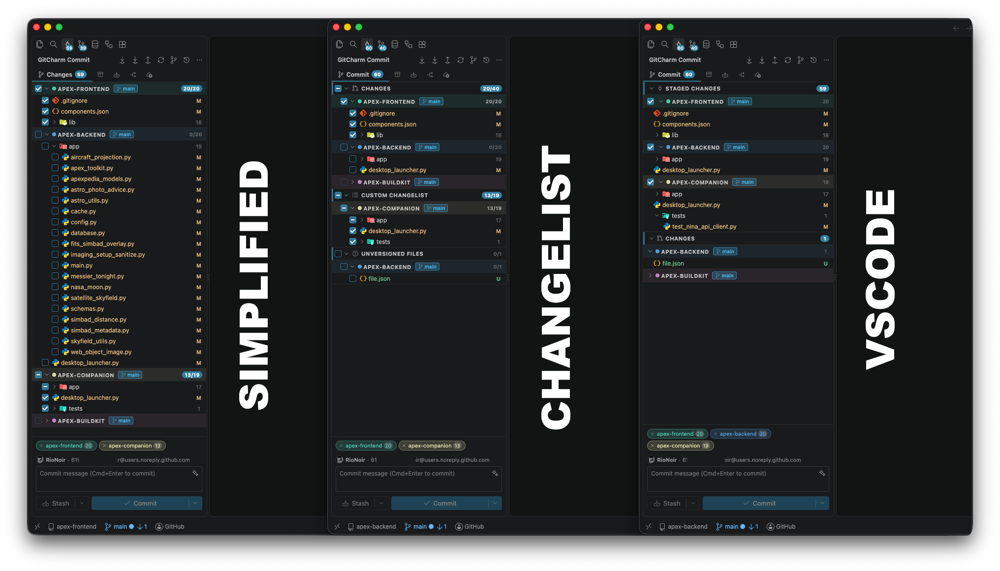
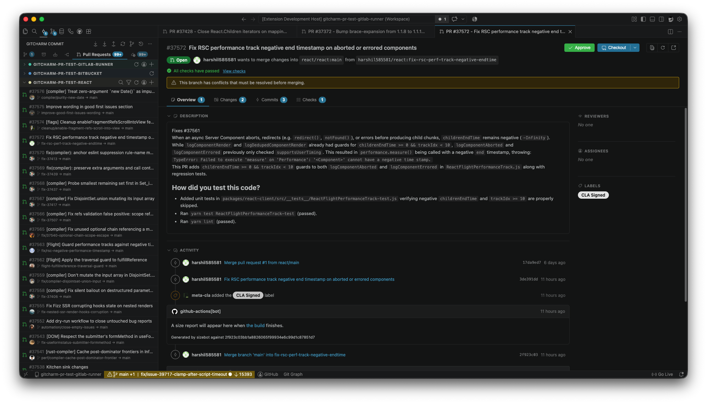
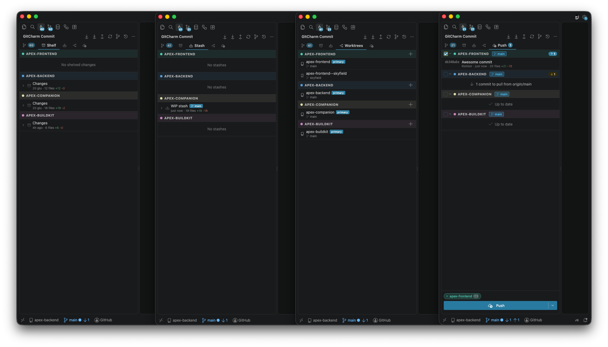
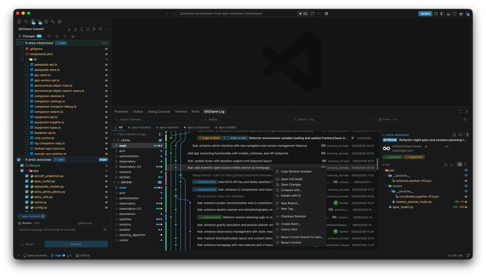
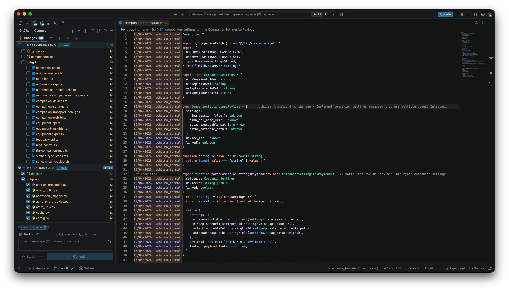

<p align="center">
  
</p>

<h1 align="center">GitCharm</h1>

<p align="center">
  Your whole Git workflow in one place.<br>
  <sub>Inspired by IntelliJ/JetBrains IDEs</sub>
</p>

<p align="center">
  
  
  
  
  
  <a href="https://github.com/RioNoir/GitCharm/actions/workflows/ci.yml"></a>
</p>

GitCharm puts your whole Git workflow in one place, across every repository and submodule in the workspace: a focused Commit panel, a Log Panel with graph and branch operations, multi-repository awareness, shelving/stashing tools, push helpers, multi-provider Pull Request and Issue management (GitHub, GitLab, Bitbucket Cloud, Gitea/Forgejo), AI-assisted commit messages and pull requests, and conflict resolution through VS Code's merge editor.

It activates automatically when the opened workspace contains a Git repository.

<a href="https://ko-fi.com/rionoir" target="_blank">
  
</a>



## ✨ Features

### 📝 Commit Panel

- Staged/unstaged file list with tree and flat views (persisted across reloads).
- Per-file diff preview directly in the panel.
- Per-file actions: open, rollback, delete, add to `.gitignore`.
- Commit selected files only, or all staged changes.
- **Commit** and **Commit & Push** unified dropdown button; **Amend** and **Amend & Push** via the dropdown.
- AI commit-message generation with multi-provider support: VS Code language models (e.g. GitHub Copilot), Anthropic API, OpenAI API, Claude CLI, Codex CLI, Gemini CLI, Gemini API, Ollama, and LM Studio. API keys and models configurable per provider. The message appears as it is written.
- Every AI prompt can be customized with the `gitcharm.ai.prompts.*` settings; **GitCharm: Customize AI Prompts** starts from the default text or resets a prompt.
- Commit message pre-filled automatically with `Merge branch 'X' into 'Y'` when merge conflicts are detected.
- New and modified files are **not** automatically selected — only files that were already selected before the change are preserved.
- **Sort Changes By** (Name, Path or Status) in the `···` title menu orders the flat list of changes; the tree view always lists folders before files.

#### View Modes

On first install, a QuickPick lets you choose your preferred view mode. You can change it at any time via `gitcharm.changesViewMode` in Settings.

| Mode | Description |
|:--|:--|
| **Simplified** | Staged and Unstaged sections grouped per repository (default) |
| **Changelists** | PhpStorm-style named changelists; files can be moved between lists |
| **VS Code** | Native-style Staged Changes / Changes sections with inline stage/unstage buttons |



#### Changelists

- Create, rename, and delete named changelists from the context menu.
- Drag files between changelists or use the context menu to reassign them.
- Default changelist and Unversioned Files list are always present.

#### Repository pills & commit targeting

- The commit message area shows a pill for each repository with staged/selected files.
- Click the **×** on a pill to quickly deselect that repository from the commit.
- In VS Code mode, a per-repository checkbox in the Staged Changes section controls which repositories are included.

#### Adaptive commit button

When there is nothing left to commit, the primary button turns into the remote action the branch actually needs — no switching to the Sync tab:

| Branch state | Button |
|:--|:--|
| Uncommitted changes | **Commit** (or **Commit & Push**) |
| No upstream yet | **Publish Branch** |
| Ahead and/or behind the upstream | **Sync Changes** with the commit counts and ↑ / ↓ arrows |

**Sync Changes** pushes, pulls, or does both, depending on what the branch needs. When your branch and the remote have diverged — after an amend, rebase, or squash — a QuickPick asks how to reconcile: **Pull, then Push**, **Pull (Rebase), then Push**, or **Force Push** (`--force-with-lease`). If the local history looks rewritten, the force option is listed first. The same prompt appears if a push is rejected because the remote moved. The dropdown always exposes **Push**, **Pull**, and **Force Push** directly.

### ☁️ Sync Tab

The remote side of every repository: what to push and what to pull.

- Lists only the repositories out of sync with their remote — commits to push, a branch to publish, or commits to pull — with an empty state when everything is up to date. Repositories with commits to push open by default, the others start collapsed.
- Commits to push, including branches without an upstream tracking branch; for commits to pull, how many (the Log Panel lists them).
- Commit count badge on the tab label: commits to push plus commits to pull, auto-updated after each commit, undo, push, pull, or fetch.
- File count badge on the Changes tab label showing the total number of modified files.
- Branch info header with matching badges (↑ ahead, ↓ behind, Unpublished) and, on hover, **Fetch**, **Pull…** (merge or rebase), and **Push** / **Publish Branch** for that repository.
- Per-commit stats showing files changed, additions, and deletions.
- The footer acts on the selected repositories: **Sync** when any of them is behind (pull and push as each needs, asking how to reconcile a diverged branch), **Push** when there is only pushing to do, **Fetch** otherwise — or **Fetch All** with nothing selected. Its dropdown has **Sync**, **Push**, **Pull (Merge)**, **Pull (Rebase)**, **Fetch**, and **Force Push**.
- Push label adapts to context: "Push", "Publish Branch", "Publish Branches", or "Push & Publish" for mixed upstream/no-upstream selections.
- **Undo** the HEAD commit (with confirmation) directly from the list of commits to push.
- **Explain with AI** context menu action on commits: opens the detail panel with an auto-generated explanation of the changes.
- **Open Full Detail** context menu action on commits.
- Click any row to jump to that commit in the Log Panel.
- **Publish** button for branches that have never been pushed.
- Silent refresh: existing commits stay visible while reloading (no flicker).

### 🔀 Pull Requests

- Dedicated **Pull Requests** tab in the Commit Panel, with multi-provider support: GitHub, GitLab, Bitbucket Cloud, and Gitea/Forgejo — auto-detected from the repository's remote URL, with a manual override per host for self-hosted instances that can't be auto-detected.
- Per-repository list with state icons (open, draft, merged, closed), author avatar, source → target branch, and total/loaded count; filter by state, author, assigned-to-me, review-requested-to-me, and mentions, plus free-text/PR-number search.
- **Account picker**: connect a new account (GitHub via VS Code's built-in authentication, or a Personal Access Token for GitLab/Bitbucket/Gitea) or switch between already-saved accounts per repository — no more silent auto-selection of a single saved account.
- **Manage Pull Request Credentials** command: a single account list grouped by provider, with rename and remove actions, and an entry to add a new account.
- Avatars (GitHub username avatar, or the account email's avatar resolved as for commit authors) shown next to accounts in the account pickers, falling back to a generic icon when no avatar can be resolved.
- Checks shown per PR in the list, GitHub-style (e.g. "✓ 3/3").
- **Create Pull Request**: two-column layout with native branch QuickPickers, a Markdown (TipTap) description editor, and a live commit/file diff preview against the selected branches.
- Markdown editor for descriptions and comments: `@` mentions with autocomplete from the repository's members, tables, H1–H3 headings, and Markdown pasted as plain text keeps its formatting.
- Generate the title and the description with AI (✨ inside each field); the description follows the repository's pull request template when there is one.
- **Pull Request detail** panel: description (editable in place), rich Activity timeline (renames, label changes, close/reopen/merge, base-branch changes, assign/review-request) with a connecting thread line and author avatars, reviewers/assignees/labels, CI checks, changed files with a full diff view, and commits.
- **Comments**: add, edit, hide/delete (with per-provider permission checks), inline Markdown editing, and minimize/unminimize on GitHub; comment-count badge on the Overview tab.
- **Merge** (with strategy choice) and **Checkout** actions with confirmation, directly from the detail header.
- **Open Full Detail** opens the same rich detail view as a persistent editor tab, restored automatically across VS Code restarts.

<br>


### 🐞 Issues

- Dedicated **Issues** tab in the Commit Panel, for the same four forges and on the same connection as Pull Requests — a repository connected once serves both tabs.
- Per-repository list with state icons, author avatar, comment count and labels; filter by state, created by me, assigned to me and mentioning me (GitHub, Gitea), plus free-text/issue-number search, with infinite scroll.
- **Issue detail** panel in an editor tab: description (editable in place), Activity timeline (comments, renames, label changes, close/reopen, assignments), assignees, labels, and the pull requests that reference or close the issue. Close, reopen, comment, and edit the title, assignees and labels directly; restored across VS Code restarts.
- **New Issue** form with a Markdown description (pre-filled from the repository's issue template), assignees and labels.
- **Create Branch** from an issue: names it from `gitcharm.issues.branchNameTemplate` (e.g. `42-fix-login-redirect`), lets you edit the name, then creates and checks it out.
- **Create Branch with AI** (under the Create Branch button): the AI reads the issue and suggests a short, related name, following your branch prefixes — still editable before the branch is created.
- **AI Explanation** of an issue (✨ button, as for pull requests): what is asked, the decisions taken in the discussion, and where to start.
- **Resolve with AI**: works out a fix and shows it before touching anything — the plan and every changed file with its diff. **Apply on New Branch** creates a branch from HEAD (AI-suggested name, editable) and writes the changes there, **without committing**, then opens the Commit Panel with a draft message. With Claude Code or Codex as the model, an agent explores the code and edits files itself in a throwaway worktree; with any other provider the model picks the files to read and answers with the edits. Uses the "Issues" AI operation, so it can have its own provider and model.
- **Reference an issue in the commit message**: from an issue row or the issue detail (or the **Reference an Issue in the Commit Message** command, which searches open issues), inserts `#42` — or `Fixes #42`, per `gitcharm.issues.commitReferenceTemplate` — at the cursor.
- **Linked issues** in the Pull Request detail panel: the issues a PR closes once merged (from the forge's API on GitHub and GitLab, from "Fixes #123"-style keywords in the description on Gitea and Bitbucket).
- Bitbucket Cloud: the issue tracker is optional (off by default) and the API token needs the `read:issue:bitbucket` / `write:issue:bitbucket` scopes; issues have a single assignee and their kind is shown as a label.

### 🗄️ Shelve & Stash

- **Shelve** with patch-based shelves: create, apply (full or partial), delete, rename, and inspect per-file diffs.
- Binary-file handling and conflict detection on unshelve.
- **Native stash** support: list, apply, pop, drop, rename, and file diff preview.
- Stashes are shown as native nodes directly in the Log Panel commit list, with the stash commit's hash and a `stash@{N}` badge.
- Row selection is maintained when the context menu is open, matching the behavior of other tabs.



### 🪟 Undocked Panel

- **Undock…** in the Log Panel burger menu (or `GitCharm: Undock` in the Command Palette) opens a native QuickPick with four options:
  - **Undock in Editor Tab (Log & Commit)** — opens a resizable editor tab with Commit Panel on the left and Log Panel on the right.
  - **Undock in New Window (Log & Commit)** — same layout in a separate VS Code window.
  - **Undock in Editor Tab** — editor tab with the Log Panel only.
  - **Undock in New Window** — separate window with the Log Panel only.
- **Default Location…** in the same burger menu (or `GitCharm: Set Default Log Panel Location` in the Command Palette) does the same thing, but *remembers* the choice: Bottom Panel, Editor Tab (Log & Commit / Only Log), or New Window (Log & Commit / Only Log). The picked location applies immediately and is written to `gitcharm.gitLogDefaultLocation` / `gitcharm.gitLogDefaultLayout`, so `GitCharm: Focus Log Panel` and its keyboard shortcut (`Ctrl/Cmd+Alt+L`) reopen the Log there — even after you close the editor tab or restart VS Code.
  - **Undock…** is session-only and never changes the setting; **Default Location…** is the persistent counterpart.
  - Picking anything other than **Bottom Panel** also removes the GitCharm Log view from the bottom panel, so you never end up with two Log surfaces. Switching back restores it.
- State is fully synchronised with the sidebar panels: commits, branches, and status update in real time in both views.
- The undocked tab shows the same toolbar actions as the Commit Panel (Fetch All, Pull All, Push All, Sync All, Branch Menu, Settings).

### 📜 Log Panel

- Commit graph with branch visualization.
- **Uncommitted changes** row on top of each repository's HEAD, updated live: select it to see the changed files against HEAD, click a file for its working-tree diff, or use **Open Changes** for a multi-file diff. Turn it off with `gitcharm.showUncommittedChangesInLog`.
- **Compare Branches** (⇄ in the title bar) shows only the commits on one branch that aren't on another — by default, what the current branch has that the default branch doesn't yet (`main..HEAD`), per repository.
- Title bar actions: Fetch and Refresh, Compare Branches, Undock, Hide/Show Filters, Hide/Show Branch Sidebar, and Clear Filters whenever a filter is active. Whether the filters bar and the sidebar are shown is remembered separately for the bottom panel and the side bar.
- When the list reaches the `gitcharm.graphMaxCommits` limit and older commits exist, a note at the bottom says so and links to the setting. Filters search the whole history, not just the loaded commits.
- Branch sidebar: local branches, remote branches, tags; single-repo workspaces hide the repository list; sidebar is collapsible.
- Filters by text, author, branch, date, and repository.
- Commit detail with changed-file list and per-file diffs.
- Smart diff resolution for added, deleted, renamed, copied, merge, and root commits.
- **Show Combined Diff** context menu entry in the commit file list.
- **Cherry-Pick Selected Changes** from a file in a commit directly into the current working tree.
- Close button in the commit detail panel; clicking any commit re-opens it.
- Bold commit message for the HEAD commit in the list.
- Author name shown in commit rows when the panel is wider than 550 px.
- Click a commit title to expand/collapse the message; if the commit has a body, it opens as a Markdown document in a VS Code tab.
- Author avatars in commit rows and commit detail, from the forges: the repository's own GitHub, GitLab, Bitbucket or Gitea when it is connected, then GitHub, GitLab and Codeberg noreply addresses — no email address is sent to third parties. Gravatar can be turned on as a last fallback (off by default). Colored-initials fallback. Initials correctly handle names with parenthesized suffixes (e.g. "Name Surname (Tag)").
- **Explain with AI** and **Open Full Detail** context menu actions; AI actions hidden when AI is disabled.
- Branch operations from the sidebar: checkout, fetch, pull, push, merge, rebase, delete, rename, compare, create a new branch, and **New Branch from "…"** (created in every repository that has that branch).
- **Tags section** in the sidebar: collapsible list with multi-repo dot indicators; tags with the same name across repos are merged into a single row; active tag highlighted when in detached HEAD state.
- Tag context menu: checkout, merge into current, push to remote, and delete (local, remote, or both).
- Commit context menu: **New Tag…** when the commit has no tags; **Manage Tags…** (QuickPick with merge/delete actions) when it does.
- **Checkout…** in the commit context menu: QuickPick lets you choose between checking out the branch or the revision (detached HEAD); works for remote-only branches too.
- **Branch options…** in the commit context menu: opens the Git Menu focused on that branch.
- Log Panel auto-refreshes in the background after a commit or push, with a loading skeleton during the fetch.
- Hides `origin/HEAD` from the remote branches list.
- **Repository tabs** above the commit list let you filter the log to a single repository at a time in multi-repo workspaces; per-repo color dots in the Branch/Tag filter dropdown group branches and tags by name across repositories.
- **Compare with…** context-menu action on files and folders (Commit Panel, Explorer/editor context menu, and commit detail) diffs the picked path against a chosen branch, tag, or commit.

<br>


### 🌿 Branch Status Bar & Git Menu

- Shows the current branch name (truncated with ellipsis if long) with dirty, ahead, behind, and diverged states; shows the short commit hash when in detached HEAD state without a tag, or the tag name when checked out on a tag.
- **Branch menu** with quick access to: **Fetch All**, **Pull**, **Push All**, **Force Push All**, **Sync All** (pull then push, stops on conflicts), branch operations, and log.
- Same operations available per-repository in the sub-menu, without redundant repo name prefixes in labels.
- **Tags section** in the per-repository menu: checkout, merge, push to remote, and delete tags; delete dialog offers three options (local, remote, or both).
- **Per-repository sub-menu** with full remote management: add, rename, change URL, and remove remotes.
- Tracks the active editor to reflect the correct repository in multi-repo workspaces.
- New branch names follow VS Code's own rules: spaces and characters git rejects are replaced with `git.branchWhitespaceChar` (`-` by default), `git.branchValidationRegex` is checked, and the input shows the name that will be used. Suggested prefixes come from `gitcharm.branchNameModels`.


### 👤 Git Profiles

- Named identity profiles (display name, `git user.name`, `git user.email`) stored in workspace settings.
- Status bar item showing the active profile; click to switch, create, edit, delete, or set a default.
- Fallback chain: active GitCharm profile → Local (repo `.git/config`) → Global (`git config --global`).
- Set **Local** or **Global** as the default source per workspace without creating a named profile.
- Reserved names `Local` and `Global` are displayed as implicit entries with source tooltip.
- Active profile applied automatically to the local repo config before every commit.
- Each workspace/repository can use a different identity.
- Avatars in the profile picker: resolves each profile's email as for commit authors (noreply addresses, then Gravatar if enabled), falling back to a generic icon when none can be resolved.


### 🔍 Git Annotations (Blame)

- Inline blame columns in the editor showing commit author, relative date, and summary.
- Ghost text with the same information rendered at the end of the current line.
- Hover actions link directly to the commit in the Log Panel.
- Accessible via editor context menu and Command Palette; toggled with dedicated commands.
- Layout adapts around edits, tabs, CodeLens, and editor alignment.

<br>


### 🗂️ Multi-Repository Workspaces

- Per-project colors in the commit graph and commit panel.
- Grouped changes and a shared commit flow across repositories.
- Common branch actions applied across all repositories in one step.
- Activity bar badge showing the total number of changed files across all repositories.
- Nested repository scanning: automatically discovers Git repositories inside workspace subfolders up to a configurable depth, skipping ignored folders (e.g. `node_modules`). Files belonging to nested repos are filtered out from their parent repository's change list, matching VS Code's built-in behavior.
- Repository context menu in the Commit Panel header (all view modes and all tabs): quick access to branch operations, fetch, push, settings, **Reveal in Explorer**, **Open in New Window**, and **Open in File Manager** for each repository.
- Hide/show individual repositories from the Commit Panel and Log Panel via the context menu or the Commit Panel's `···` title menu; hidden repos are persisted per workspace.
- Sort repositories by discovery time, name, or path from the Commit Panel's `···` title menu; the choice is persisted across reloads.

### 🌳 Worktrees

- Dedicated **Worktrees** tab in the Commit Panel listing all worktrees for each repository.
- Per-worktree actions: open in Explorer, open in new window, open in File Manager, add to workspace, lock/unlock, remove, and force-remove.
- Create new worktrees and prune stale ones directly from the tab.
- Primary worktree clearly labeled with a **primary** badge.

### ⚔️ Conflict Resolution

- Conflicted files open in VS Code's built-in 3-way merge editor, from the Commit Panel or with **GitCharm: Open Merge Editor**.
- The commit message is pre-filled with `Merge branch 'X' into 'Y'`, and the GitCharm sidebar opens when a merge conflict is resolved (`gitcharm.openCommitPanelOnConflictResolved`).

## 📋 Requirements

- Visual Studio Code `1.93.0` or newer.
- Git installed and available in the workspace.
- Node.js `18` or newer and npm for development or packaging.

GitCharm uses VS Code's built-in Git extension when available and falls back to direct Git operations through `simple-git`.

## 📦 Installation

### From a VSIX

Build and package the extension:

```bash
npm install
npm run build
npm run package
```

Then install the generated `.vsix`:

```bash
code --install-extension gitcharm-<version>.vsix
```

### Development Host

Install dependencies, build once, then launch the extension host from VS Code:

```bash
npm install
npm run build
```

Open this repository in VS Code and run **Run Extension** from the Debug panel.

For iterative development:

```bash
npm run watch
```

## 🛠️ Usage

Open a workspace that contains one or more Git repositories. GitCharm adds:

- **GitCharm Commit** in the Activity Bar.
- **GitCharm Log** in the bottom Panel.
- A **branch item** and a **profile item** in the Status Bar.
- Commands in the Command Palette.

Use the Commit panel to select files, inspect diffs, write a commit message, commit, commit and push, shelve changes, manage stashes, or review unpushed commits.

Use the Log panel to browse history, filter commits, inspect changed files, open diffs, and run branch or commit operations.

Use the Status Bar branch menu for fast project-wide actions such as updating all repositories, pushing, creating branches, switching branches, managing remotes, or handling merge/rebase states.

## ⌨️ Commands

| Command | Description |
|:--|:--|
| `GitCharm: Focus Log Panel` | Focuses the Log Panel wherever it is set to open. |
| `GitCharm: Commit` | Commits the selected changes. |
| `GitCharm: Fetch All Remotes` | Fetches all remotes across all repositories. |
| `GitCharm: Pull All (Update Project)` | Pulls all repositories (prompts for merge or rebase strategy). |
| `GitCharm: Push All` | Pushes all repositories. |
| `GitCharm: Sync All (Pull + Push)` | Pulls then pushes all repositories; stops if any pull fails. |
| `GitCharm: Refresh` | Re-discovers repositories and refreshes both the Commit Panel and the Log Panel. |
| `GitCharm: Branch Menu` | Opens the Status Bar branch menu. |
| `GitCharm: Check for Orphaned Branches` | Fetches, then lists local branches whose remote branch was deleted. |
| `GitCharm: Open Merge Editor` | Opens VS Code's merge editor for the active conflicted file. |
| `GitCharm: Show File History` | Shows the Git history of the active file. |
| `GitCharm: Compare with...` | Diffs a file or folder against a chosen branch, tag, or commit. |
| `GitCharm: Manage Hidden Repositories` | Reopens repositories previously hidden from the Commit Panel and Log Panel. |
| `GitCharm: Manage Git Profiles` | Opens the Git profile manager. |
| `GitCharm: Switch Git Profile` | Switches the active Git profile for the current workspace. |
| `GitCharm: Open Git Annotations` / `Close Git Annotations` / `Toggle Git Annotations` | Shows or hides inline blame annotations in the active editor. |
| `GitCharm: Undock` | Opens a QuickPick to undock the Log Panel (with or without the Commit Panel) into an editor tab or a new window. |
| `GitCharm: Set Default Log Location` | Opens a QuickPick to choose — and persist — where the Log Panel opens: bottom panel, editor tab, or a new window. |
| `GitCharm: Add Worktree` / `Prune Worktrees` | Creates a worktree, or removes stale worktree entries. |
| `GitCharm: Select AI Model` | Opens a QuickPick to choose the AI provider and model. |
| `GitCharm: Customize AI Prompts` | Edits or resets the prompts used by the AI features. |
| `GitCharm: Manage Pull Request Credentials` | Opens the Pull Request account manager (add, rename, remove accounts). |
| `GitCharm: Refresh Pull Requests` | Refreshes the Pull Requests tab, bypassing the cache. |
| `GitCharm: Refresh Issues` | Refreshes the Issues tab, bypassing the cache. |
| `GitCharm: Reference an Issue in the Commit Message` | Searches the open issues of the connected repositories and inserts a reference to the chosen one into the commit message. |
| `GitCharm: Show Output Log` | Opens the GitCharm output log, useful when reporting a bug. |

## ⌨️ Keybindings

| Keybinding | macOS | Command |
|:--|:--|:--|
| `Ctrl+Alt+L` | `Cmd+Alt+L` | `GitCharm: Focus Log Panel` |
| `Ctrl+Alt+K` | `Cmd+Alt+K` | `GitCharm: Commit` |

## ⚙️ Settings

| Setting | Default | Description |
|:--|:--|:--|
| `gitcharm.graphMaxCommits` | `1000` | Maximum number of commits loaded into the Log Panel graph (100–10000). |
| `gitcharm.showUncommittedChangesInLog` | `true` | Show a row for uncommitted changes on top of the Log Panel graph. |
| `gitcharm.gitLog.showAuthor` | `true` | Show the author's name in each row of the Log Panel commit list (when the list is wide enough). |
| `gitcharm.gitLog.showAuthorAvatar` | `true` | Show the author's avatar in each row of the Log Panel commit list. |
| `gitcharm.gitLog.showDate` | `true` | Show the commit date in each row of the Log Panel commit list. |
| `gitcharm.gitLog.showHash` | `true` | Show the short commit hash in each row of the Log Panel commit list. |
| `gitcharm.gitLog.showInlineBranches` | `true` | Show branch, tag and stash badges next to the commits they point to in the Log Panel commit list. |
| `gitcharm.fetchOnStartup` | `true` | Fetches all remotes once when GitCharm activates. |
| `gitcharm.notifyOnIncomingCommits` | `true` | Notify on startup when there are incoming commits to pull. |
| `gitcharm.notifyOnUnpushedCommits` | `true` | Notify on startup when there are unpushed commits. |
| `gitcharm.notifyOnOrphanBranches` | `true` | Notify after a fetch when local branches have lost their remote branch. |
| `gitcharm.projectColors` | `{}` | Maps workspace folder/repository names to hex colors for multi-repo views. |
| `gitcharm.repositoryScanMaxDepth` | `1` | Maximum depth of workspace subfolders to scan for Git repositories. `0` only checks workspace folders. |
| `gitcharm.repositoryScanIgnoredFolders` | `["node_modules"]` | Folder names or workspace-relative paths skipped while scanning for nested Git repositories. |
| `gitcharm.submoduleMaxDepth` | `5` | Maximum nesting depth of Git submodules shown as repositories. `1` only shows direct submodules, `0` none. In a workspace with more than 5 submodules they start hidden: a notification offers to show them, and **GitCharm: Show Submodules** / **Hide Submodules** switch it later, per workspace. |
| `gitcharm.branchNameModels` | `[]` | Branch name prefixes suggested when creating a branch (e.g. `feature/`, `bugfix/`). |
| `gitcharm.showLastCommitInBranchMenu` | `false` | Show each branch's and tag's last commit in the branch and tag menus. |
| `gitcharm.autoRefreshInterval` | `0` | Auto-refresh interval in seconds. `0` disables interval refresh and uses file watchers only. |
| `gitcharm.gitLogDefaultLocation` | `"panel"` | Where `GitCharm: Focus Log Panel` opens the Log: `panel`, `editorTab`, or `newWindow`. Anything but `panel` also hides the Log view from the bottom panel. |
| `gitcharm.gitLogDefaultLayout` | `"logAndCommit"` | What the Log shows outside the bottom panel: `logAndCommit` or `logOnly`. Ignored when the location is `panel`. |
| `gitcharm.changesViewMode` | `"simplified"` | How to display changed files: `simplified`, `changelists`, or `vscode`. Chosen via QuickPick on first install. |
| `gitcharm.defaultCommitAction` | `"commit"` | Main action of the commit button: `commit` or `commitAndPush`. |
| `gitcharm.defaultSaveAction` | `"stash"` | Main action of the Save button: `stash` or `shelve`. |
| `gitcharm.promptAddUntrackedToGit` | `true` | Offer to add new untracked files to Git. |
| `gitcharm.protectedBranches` | `[]` | Branches GitCharm guards, e.g. `main` or `release/*` (`*` matches anything). Committing or pushing to one asks first; force-pushing to one is refused. |
| `gitcharm.confirm.discardChanges` | `true` | Ask before discarding changes or deleting files and folders from the Commit Panel. |
| `gitcharm.confirm.dropStashesAndShelves` | `true` | Ask before dropping a stash or deleting a shelf. |
| `gitcharm.confirm.commitOperations` | `true` | Ask before reverting, dropping or undoing commits. |
| `gitcharm.confirm.deleteBranches` | `true` | Ask before deleting a branch. |
| `gitcharm.autoFetchInterval` | `0` | Fetch from every remote every this many minutes while VS Code is focused (`0`: off). New incoming commits are notified as at startup. |
| `gitcharm.fetchPrune` | `true` | Remove remote-tracking branches that no longer exist on the remote when fetching. |
| `gitcharm.pullMode` | `ask` | How GitCharm pulls: `ask` (merge/rebase picker where offered, merge elsewhere), `merge`, `rebase` or `ffOnly`. |
| `gitcharm.commitSignoff` | `false` | Add a Signed-off-by line to every commit (`git commit --signoff`). |
| `gitcharm.commitPanel.subjectMaxLength` | `0` | Warn when the commit message's first line is longer than this many characters (`0`: off). |
| `gitcharm.dateFormat` | `auto` | How dates are shown: `auto` (absolute in the Log Panel, relative elsewhere for recent dates), `absolute` or `relative`. Takes effect after reloading the window. |
| `gitcharm.statusBar.showBranch` | `true` | Show the current branch (the Git Menu) in the status bar. |
| `gitcharm.statusBar.showProfile` | `true` | Show the Git profile in use in the status bar. |
| `gitcharm.pullRequests.defaultFilter` | `open` | The filter each repository's pull request list starts with: `open`, `mine`, `assignedToMe`, `reviewRequested` or `mentioningMe`. |
| `gitcharm.pullRequests.autoRefreshInterval` | `0` | Refresh the pull request list every this many minutes while its tab is open and VS Code is focused (`0`: off). |
| `gitcharm.issues.defaultFilter` | `open` | The filter each repository's issue list starts with: `open`, `mine`, `assignedToMe` or `mentioningMe`. |
| `gitcharm.issues.autoRefreshInterval` | `0` | Refresh the issue list every this many minutes while its tab is open and VS Code is focused (`0`: off). |
| `gitcharm.issues.branchNameTemplate` | `{number}-{title}` | The name suggested for a branch created from an issue: `{number}`, `{title}` (lowercase, hyphenated) and `{user}` (your forge username). |
| `gitcharm.issues.commitReferenceTemplate` | `#{number}` | The text inserted into the commit message when referencing an issue, e.g. `Fixes #{number}`. `{title}` is also available. |
| `gitcharm.commitPanel.showShelfTab` | `true` | Show the Shelf tab in the Commit Panel. |
| `gitcharm.commitPanel.showStashTab` | `true` | Show the Stash tab in the Commit Panel. |
| `gitcharm.commitPanel.showWorktreesTab` | `true` | Show the Worktrees tab in the Commit Panel. |
| `gitcharm.commitPanel.showPullRequestsTab` | `true` | Show the Pull Requests tab in the Commit Panel. |
| `gitcharm.commitPanel.showIssuesTab` | `true` | Show the Issues tab in the Commit Panel. |
| `gitcharm.commitPanel.showSyncTab` | `true` | Show the Sync tab (commits to push and to pull) in the Commit Panel. |
| `gitcharm.commitPanel.tabOrder` | all tabs | The order of the Commit Panel's tabs. Tabs left out of the list keep their place at the end; hidden tabs stay hidden. |
| `gitcharm.commitPanel.defaultTab` | `changes` | The tab the Commit Panel opens on: `changes`, `shelf`, `stash`, `worktrees`, `issues`, `pullRequests`, `sync`, or `lastUsed` (the last one used in the workspace). A hidden tab falls back to Changes. |
| `gitcharm.commitPanel.tabLabels` | `active` | Which tabs show their name next to the icon: `active`, `always` or `never` (icons only). |
| `gitcharm.commitPanel.showChangesBadge` | `true` | Show the number of changed files on the Changes tab. |
| `gitcharm.commitPanel.showShelfBadge` | `false` | Show the number of shelved changes on the Shelf tab. |
| `gitcharm.commitPanel.showStashBadge` | `false` | Show the number of stashes on the Stash tab. |
| `gitcharm.commitPanel.showWorktreesBadge` | `false` | Show the number of linked worktrees on the Worktrees tab. |
| `gitcharm.commitPanel.showSyncBadge` | `true` | Show the number of commits to push and to pull on the Sync tab. |
| `gitcharm.commitPanel.showPullRequestsBadge` | `true` | Show the number of pull requests on the Pull Requests tab. |
| `gitcharm.commitPanel.showIssuesBadge` | `true` | Show the number of issues on the Issues tab. |
| `gitcharm.commitPanel.showActivityBarBadge` | `true` | Show the number of changed files on GitCharm's icon in the activity bar. |
| `gitcharm.openCommitPanelOnConflictResolved` | `true` | Open the GitCharm sidebar when a merge conflict is resolved. |
| `gitcharm.suppressDivergedBranchWarning` | `false` | Suppress the "Branches have diverged" warning in the Git Menu and status bar. |
| `gitcharm.gitAnnotations.enabled` | `true` | Enable inline Git blame annotations in the editor. |
| `gitcharm.gitGhostText.enabled` | `true` | Enable inline Git ghost text in the editor. |
| `gitcharm.avatars.enabled` | `true` | Show author avatars, taken from the forges: the repository's own GitHub, GitLab, Bitbucket or Gitea when it is connected, and GitHub, GitLab and Codeberg noreply addresses. No email address is sent to third parties. |
| `gitcharm.avatars.gravatar.enabled` | `false` | When no forge has an avatar for an author, look it up on Gravatar. **Privacy:** this sends a hash of the author's email to gravatar.com, which can reveal the address. Leave disabled for private or company repositories. |
| `gitcharm.ai.enabled` | `true` | Enable AI-powered features (commit messages, pull request title and description, explanations). |
| `gitcharm.ai.provider` | `"vscode-lm"` | AI provider: `vscode-lm`, `claude-api`, `openai-api`, `gemini-api`, `claude-cli`, `codex-cli`, `gemini-cli`, `ollama`, or `lmstudio`. |
| `gitcharm.ai.language` | `""` | Language for AI-generated text (e.g. `en`, `it`). Defaults to English when empty. |
| `gitcharm.ai.maxDiffChars` | `8000` | Maximum characters of diff sent to the AI model. |
| `gitcharm.ai.*` | | Per-provider API keys, models, CLI paths and local server URLs (e.g. `gitcharm.ai.claudeApiKey`, `gitcharm.ai.ollamaUrl`). **GitCharm: Select AI Model** picks the provider and model. |
| `gitcharm.ai.prompts.*` | `""` | Custom instructions for each AI feature (`commitMessage`, `pullRequestTitle`, `pullRequestDescription`, `explainCommit`, `explainPullRequest`). Empty uses the default prompt. |
| `gitcharm.pullRequests.hostProviderOverrides` | `{}` | Manual forge-type override per Git host for self-hosted instances that can't be auto-detected, e.g. `{ "git.mycompany.com": "gitea" }`. Valid values: `github`, `gitlab`, `bitbucket`, `gitea`. |
| `gitcharm.pullRequests.defaultTargetBranch` | `""` | Default target branch for new pull requests when the repo's default branch can't be determined from the forge API (leave empty to auto-detect main/master). |
| `gitcharm.pullRequests.defaultMergeStrategy` | `"merge"` | Default strategy pre-selected on the "Merge pull request" button in the Pull Request detail panel: `merge`, `squash`, `rebase`, or `fastForward`. Falls back to the first strategy the forge/provider supports if this one isn't available for a given PR. |
| `gitcharm.pullRequests.defaultCheckoutAction` | `"pr"` | Default action for the main "Checkout" button in the Pull Request detail panel: `pr` (Checkout Pull Request) or `branch` (Checkout Branch). The other option is still available from its dropdown. |
| `gitcharm.resetViewLocationsOnStartup` | `false` | Run VS Code's **Reset View Locations** on startup, to clear stale GitCharm badge placement. |

Git profiles are stored by GitCharm itself (not in settings) and managed with **GitCharm: Manage Git Profiles**.

Example:

```json
{
  "gitcharm.fetchOnStartup": true,
  "gitcharm.graphMaxCommits": 2000,
  "gitcharm.projectColors": {
    "api": "#ff6b6b",
    "web": "#4ec9b0"
  },
  "gitcharm.gitAnnotations.enabled": true
}
```

## 🏗️ Project Structure

```text
src/host/                 VS Code extension host code
src/host/git/             Git, diff, conflict, blame, workspace, and shelve services
src/host/panels/          Webview providers for Commit, Log, Undocked Panel, Pull Requests and Issues
src/host/pullRequests/    Multi-provider Pull Request manager, per-provider API clients, and credential storage
src/host/issues/          Issue manager and per-provider issue API clients (on the Pull Requests connection)
src/host/ui/              Status bar controllers, badge controller, and annotation controller
src/webview/commitPanel/  React Commit panel
src/webview/gitLog/       React Log Panel
src/webview/commitFullDetail/ React commit "Full Detail" editor-tab panel
src/webview/undockedPanel/ React undocked panel (Commit + Log side by side)
src/webview/pullRequestCreate/ React Create Pull Request panel
src/webview/pullRequestDetail/ React Pull Request detail panel
src/webview/issueDetail/  React Issue detail panel
src/webview/issueCreate/  React New Issue panel
src/webview/shared/       Shared webview components, hooks, and message types
media/                    Extension icons, codicons, and assets
out/                      Built extension and webview bundles
```

## 🔧 Development Scripts

| Script | Description |
|:--|:--|
| `npm run build` | Builds both extension host and webview bundles. |
| `npm run build:host` | Builds the extension host bundle with esbuild. |
| `npm run build:webview` | Builds all React webview bundles. |
| `npm run watch` | Watches host and webview sources in parallel. |
| `npm run lint` | Runs ESLint on TypeScript and TSX sources. |
| `npm run typecheck` | Type-checks the main TypeScript project. |
| `npm run typecheck:webview` | Type-checks the webview TypeScript project. |
| `npm run l10n:export` | Regenerates `l10n/bundle.l10n.json` from the `l10n.t()` calls in `src/`. |
| `npm run l10n:check` | Validates translation files (missing/stale keys, placeholders). `--strict` also fails on missing translations. |
| `npm run package` | Creates a VSIX package with `vsce`. |
| `npm run publish` | Publishes the extension with `vsce publish`. |

## 🌐 Languages

GitCharm follows VS Code's display language. Available translations: English, Deutsch, Español, Français, Italiano, 简体中文 (zh-cn), 繁體中文 (zh-tw).
Translations are welcome — see [Localization](CONTRIBUTING.md#localization).

## 📌 Notes

- GitCharm is designed for Git workspaces and multi-root workspaces where each folder may be its own repository.
- Destructive operations (rollback, delete, branch delete, reset, stash drop, shelve drop, commit undo) ask for confirmation.
- AI features need a configured provider: a VS Code language model such as GitHub Copilot (the default), an API key, a CLI on `PATH`, or a local Ollama/LM Studio server.
- Git Annotations require the file to be tracked in a Git repository with at least one commit.

## 🤝 Contributing

Contributions are welcome! See [CONTRIBUTING.md](CONTRIBUTING.md) for setup instructions, the development workflow, and how to report bugs or request features.

## 🙏 Acknowledgements

GitCharm is built on top of the excellent work of the open-source community. It wouldn't function without:

| Package | Role |
|:--|:--|
| [simple-git](https://github.com/steveukx/git-js) | Direct Git operations fallback when the VS Code Git API is unavailable. |
| [React](https://react.dev/) | Renders every webview panel (Commit, Log, Undocked Panel). |
| [Zustand](https://github.com/pmndrs/zustand) | State management across all webview panels. |
| [@tanstack/react-virtual](https://github.com/TanStack/virtual) | Virtualized rendering of large commit and file lists. |
| [Prism.js](https://prismjs.com/) | Syntax highlighting in diff and file previews. |
| [@vscode/codicons](https://github.com/microsoft/vscode-codicons) | Icons throughout the panels, matching VS Code's native look. |
| [material-icon-theme](https://github.com/material-extensions/vscode-material-icon-theme) | File-type icons in the Commit panel's file tree. |

Thanks also to everyone who opens issues, submits pull requests, and provides feedback.

## 📄 License

This project is distributed under the GNU General Public License v3.0.
