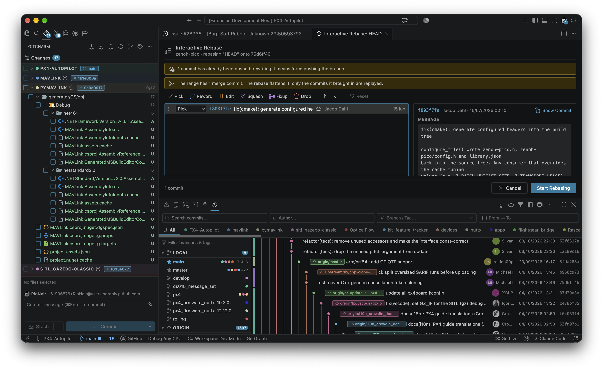
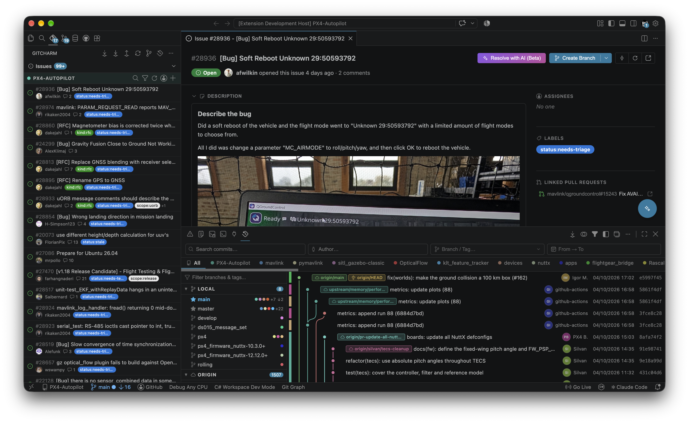
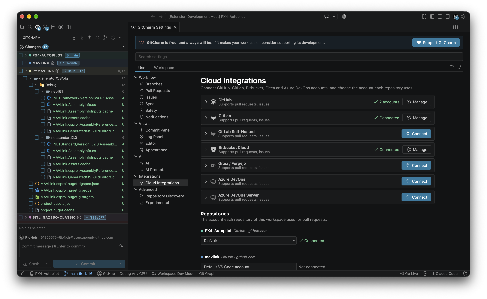

<p align="center">
  
</p>

<h1 align="center">GitCharm</h1>

<p align="center">
  Your whole Git workflow in one place.<br>
  <sub>Inspired by IntelliJ/JetBrains IDEs</sub>
</p>

<p align="center">
  
  
  
  
  
  <a href="https://github.com/RioNoir/GitCharm/actions/workflows/ci.yml"></a>
</p>

GitCharm brings a JetBrains-style Git experience to VS Code: a focused Commit Panel, a Log Panel with graph, interactive rebase, shelves and stashes, pull requests and issues for every major forge, and AI help where it saves you time — across every repository and submodule in your workspace.

<a href="https://ko-fi.com/rionoir" target="_blank">
  
</a>


## ✨ Features

### 📝 Commit Panel

- Tree or flat list of changes with inline diff preview; commit only the files you select, even across several repositories at once.
- Per-file actions: open, rollback, delete, add to `.gitignore`, compare with a branch, tag or commit.
- **Commit**, **Commit & Push**, **Amend** — and when there's nothing left to commit, the button becomes **Publish Branch** or **Sync Changes**. If your branch and the remote have diverged, it asks whether to pull, rebase or force push (`--force-with-lease`).
- Three view modes, chosen on first install:

  | Mode | Description |
  |:--|:--|
  | **Simplified** | Staged and unstaged changes grouped per repository (default) |
  | **Changelists** | PhpStorm-style named changelists; drag files between them |
  | **VS Code** | Native-style Staged Changes / Changes with inline stage/unstage |

- **AI commit messages** written only from the files you're committing, streamed as they're generated.
- Tabs for **Sync** (commits to push and pull, with badges), **Shelf**, **Stash**, **Worktrees**, **Pull Requests** and **Issues** — each one can be hidden or reordered.


### 📜 Log Panel

- Commit graph with a branch and tag sidebar; filters by text, author, branch, date and repository search the whole history.
- Commit details with per-file diffs, **Cherry-Pick Selected Changes** from a single file, and **Explain with AI**.
- **Compare Branches** (⇄) shows only the commits one branch has and the other doesn't — by default, what your branch has that `main` doesn't yet.
- **Combined changes**: select several commits — even across repositories — and see what they change together. With two commits, **Snapshots** diffs one against the other.
- A live **Uncommitted changes** row on top of the graph.
- Branch operations from the sidebar: checkout, merge, rebase, rename, delete, push, pull, and create a branch in every repository at once. Tags can be created, merged, pushed and deleted from the commit context menu.
- Author avatars from your connected forge — no email address is sent to third parties.
- Undock the Log (alone or with the Commit Panel) into an editor tab or a separate window, and choose where it opens by default.


### 🔁 Interactive Rebase

An IntelliJ-style editor: **pick**, **reword**, **edit**, **squash**, **fixup** or **drop** commits (also with the P/R/E/S/F/D keys), reorder them by drag and drop or Alt+Up/Down, and write new messages before the rebase even starts — so git only stops for **Edit** and on conflicts.

Start it from a commit in the Log, from a branch in the sidebar, or with **GitCharm: Interactive Rebase…**. Pushed commits are pointed out before you start, and uncommitted changes can be stashed and restored around the rebase. With `git config --global sequence.editor "code --wait"`, a `git rebase -i` from the terminal opens the same editor.



### 🔀 Pull Requests & 🐞 Issues

Works with **GitHub, GitLab, Bitbucket Cloud, Gitea/Forgejo, Azure DevOps and Azure DevOps Server 2020+** (self-hosted instances included), detected from the remote URL. Sign in with your VS Code GitHub or Microsoft account, or use a personal access token.

- Browse, filter and search pull requests and issues without leaving VS Code: open, mine, assigned to me, review requested, mentioning me.
- Create pull requests with a Markdown editor (`@` mentions, tables, the repository's PR template), a live diff preview, and AI-generated title and description.
- Full detail view: activity timeline, comments, reviewers, labels, CI checks, changed files with diffs, commits, **Merge** (with strategy choice) and **Checkout**.
- From an issue: **Create Branch** (AI can suggest the name), insert `#42` or `Fixes #42` in the commit message, or let **Resolve with AI (Beta)** draft a fix on a new branch — shown to you before anything is written, and never committed for you.
- On Azure DevOps, the Issues tab lists work items of any process template.




### 🤖 AI Assistance

Commit messages, pull request titles and descriptions, commit/PR/issue explanations, branch names and **conflict resolution**, with the provider you prefer:

- **VS Code language models** (e.g. GitHub Copilot) — the default, no setup needed if you already use one.
- **APIs**: Anthropic, OpenAI, Gemini — keys are kept in VS Code's secret storage.
- **CLIs**: Claude Code, Codex, Gemini CLI.
- **Local**: Ollama, LM Studio.

Each operation can use its own provider and model, every prompt can be customized (**GitCharm: Customize AI Prompts**), and AI can be turned off entirely with `gitcharm.ai.enabled`.

### 🗂️ Multi-Repository Workspaces

- Nested repositories and submodules discovered automatically, with configurable depth and ignored folders.
- One commit flow, one sync and one set of branch actions across all repositories.
- Per-repository colors in the graph and the Commit Panel; filter the Log to one repository with a click.
- Hide repositories you don't need — remembered per workspace.

### 🧰 And More

- **Shelve & Stash**: patch-based shelves with partial unshelve, native stashes shown right in the Log graph.
- **Worktrees**: create, open, lock, remove and prune them from their own tab.
- **Git Menu** in the status bar: fetch, pull, push and sync every repository at once, plus branches, tags and remotes per repository.
- **Git Profiles**: switch the identity (`user.name` / `user.email`) you commit with, per workspace.
- **Git Annotations**: inline blame columns and end-of-line ghost text, linked to the Log.
- **Conflict resolution** in VS Code's 3-way merge editor, or with AI from a CodeLens on each conflict.
- **Protected branches**: committing or pushing to them asks first, force pushing is refused.
- **Orphaned branches**: get notified when a local branch has lost its remote one.


### ⚙️ Settings Page

Everything is configured from **GitCharm: Settings**, a dedicated page styled after VS Code's own Settings editor, with search, User/Workspace scopes and a live preview for each category — including AI providers (with **Test Connection**) and the **Cloud Integrations** that connect your forge accounts.



## 📦 Installation

Install **GitCharm** from the [VS Code Marketplace](https://marketplace.visualstudio.com/items?itemName=RioNoir.gitcharm), or search for it in the Extensions view. It activates automatically when the workspace contains a Git repository.

**Requirements:** VS Code `1.93` or newer and Git.

### From source

With Node.js `18` or newer:

```bash
npm install
npm run build
npm run package
code --install-extension gitcharm-<version>.vsix
```

To work on GitCharm itself, see [CONTRIBUTING.md](CONTRIBUTING.md).

## 🚀 Getting Started

1. Open **GitCharm** in the Activity Bar to commit, and **GitCharm Log** in the bottom panel to browse history.
2. Click the branch in the status bar for the Git Menu, and the profile next to it to switch identity.
3. Run **GitCharm: Settings** to pick an AI provider and connect your GitHub, GitLab, Bitbucket, Gitea or Azure DevOps account.

## ⌨️ Commands & Shortcuts

| Shortcut | macOS | Command |
|:--|:--|:--|
| `Ctrl+Alt+L` | `Cmd+Alt+L` | `GitCharm: Focus Log Panel` |
| `Ctrl+Alt+K` | `Cmd+Alt+K` | `GitCharm: Commit` |

Some of the most useful commands:

| Command | Description |
|:--|:--|
| `GitCharm: Branch Menu` | Opens the Git Menu. |
| `GitCharm: Fetch All Remotes` | Fetches all remotes across all repositories. |
| `GitCharm: Pull All (Update Project)` | Pulls all repositories, with merge or rebase. |
| `GitCharm: Push All` / `Sync All (Pull + Push)` | Pushes, or pulls then pushes, every repository. |
| `GitCharm: Interactive Rebase...` | Rebases the current branch interactively. |
| `GitCharm: Show File History` | Shows the Git history of the active file. |
| `GitCharm: Compare with...` | Diffs a file or folder against a branch, tag, or commit. |
| `GitCharm: Toggle Git Annotations` | Shows or hides inline blame in the active editor. |
| `GitCharm: Resolve Conflicts with AI` | Resolves the conflicts of the active file with AI. |
| `GitCharm: Undock` | Moves the Log Panel to an editor tab or a new window. |
| `GitCharm: Switch Git Profile` | Switches the Git identity for the workspace. |
| `GitCharm: Settings` | Opens the GitCharm settings page. |
| `GitCharm: Show Output Log` | Opens the GitCharm log, useful when reporting a bug. |

All commands are in the Command Palette under **GitCharm** — see the [full list of commands](REFERENCE.md#commands).

## ⚙️ Settings

All settings are easiest to change from **GitCharm: Settings**. A selection of the most useful ones — see the [full list of settings](REFERENCE.md#settings) for all of them:

| Setting | Default | Description |
|:--|:--|:--|
| `gitcharm.changesViewMode` | `simplified` | How changes are shown: `simplified`, `changelists` or `vscode`. |
| `gitcharm.defaultCommitAction` | `commit` | Main action of the commit button: `commit` or `commitAndPush`. |
| `gitcharm.defaultSaveAction` | `stash` | Main action of the Save button: `stash` or `shelve`. |
| `gitcharm.pullMode` | `ask` | How GitCharm pulls: `ask`, `merge`, `rebase` or `ffOnly`. |
| `gitcharm.fetchOnStartup` | `true` | Fetch all remotes when GitCharm starts. |
| `gitcharm.autoFetchInterval` | `0` | Fetch every this many minutes while VS Code is focused (`0`: off). |
| `gitcharm.protectedBranches` | `[]` | Branches to guard, e.g. `main` or `release/*`. |
| `gitcharm.branchNameModels` | `[]` | Prefixes suggested for new branches, e.g. `feature/`, `bugfix/`. |
| `gitcharm.commitSignoff` | `false` | Add a Signed-off-by line to every commit. |
| `gitcharm.graphMaxCommits` | `1000` | Commits loaded into the Log graph (100–10000). |
| `gitcharm.gitLogDefaultLocation` | `panel` | Where the Log opens: `panel`, `editorTab` or `newWindow`. |
| `gitcharm.repositoryScanMaxDepth` | `1` | How deep to look for nested repositories in the workspace. |
| `gitcharm.submoduleMaxDepth` | `5` | How deep to show nested submodules (`0`: none). |
| `gitcharm.projectColors` | `{}` | A color for each repository in multi-repo views. |
| `gitcharm.commitPanel.tabOrder` | all tabs | Order of the Commit Panel tabs; each one can also be hidden. |
| `gitcharm.issues.branchNameTemplate` | `{number}-{title}` | Name suggested for a branch created from an issue. |
| `gitcharm.issues.commitReferenceTemplate` | `#{number}` | Text inserted when referencing an issue, e.g. `Fixes #{number}`. |
| `gitcharm.pullRequests.defaultMergeStrategy` | `merge` | Pre-selected merge strategy: `merge`, `squash`, `rebase` or `fastForward`. |
| `gitcharm.ai.enabled` | `true` | Enable the AI features. |
| `gitcharm.ai.provider` | `vscode-lm` | Default AI provider. |
| `gitcharm.ai.language` | `""` | Language of AI-generated text (e.g. `it`); VS Code's display language when empty. |
| `gitcharm.avatars.gravatar.enabled` | `false` | Fall back to Gravatar for avatars. Sends a hash of the author's email to gravatar.com. |

Example:

```json
{
  "gitcharm.defaultCommitAction": "commitAndPush",
  "gitcharm.protectedBranches": ["main", "release/*"],
  "gitcharm.branchNameModels": ["feature/", "bugfix/"],
  "gitcharm.projectColors": {
    "api": "#ff6b6b",
    "web": "#4ec9b0"
  }
}
```

## 🌐 Languages

GitCharm follows VS Code's display language: English, Deutsch, Español, Français, Italiano, 简体中文, 繁體中文.
Translations are welcome — see [Localization](CONTRIBUTING.md#localization).

## 🤝 Contributing

Contributions are welcome! See [CONTRIBUTING.md](CONTRIBUTING.md) for setup, the development workflow, and how to report bugs or request features.

## 🙏 Acknowledgements

GitCharm is built on [simple-git](https://github.com/steveukx/git-js), [React](https://react.dev/), [Zustand](https://github.com/pmndrs/zustand), [TanStack Virtual](https://github.com/TanStack/virtual), [Prism.js](https://prismjs.com/), [Codicons](https://github.com/microsoft/vscode-codicons) and [Material Icon Theme](https://github.com/material-extensions/vscode-material-icon-theme). Thanks also to everyone who opens issues, submits pull requests, and provides feedback.

## 📄 License

Distributed under the GNU General Public License v3.0.
